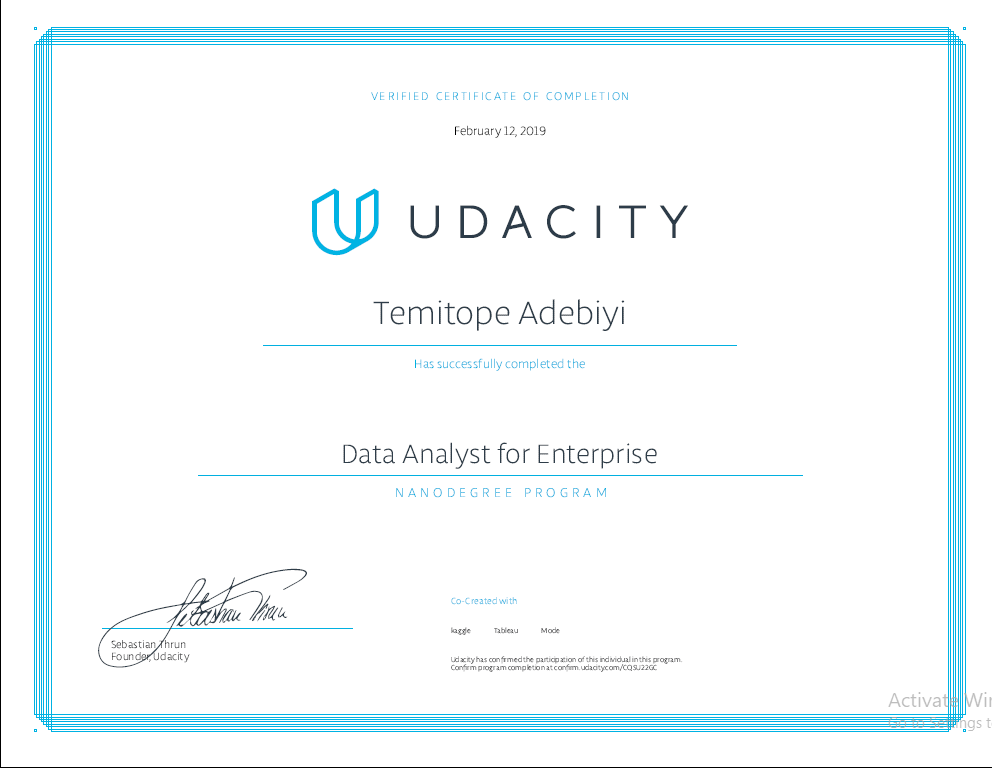
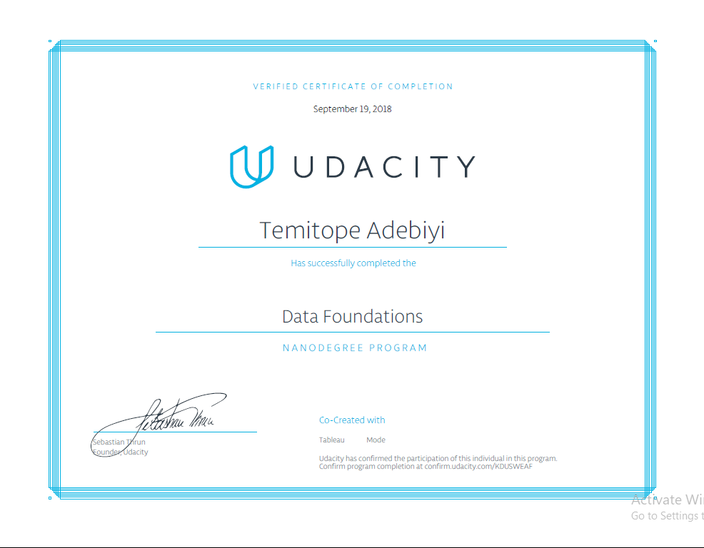

# Data-Analyst-Portfolio

---------------------------------------------------------------------------------------------------------------------

## This folder hosts all my personal projects done so far on Data Analysis.

### [Project 1 — Interpretation of data visualization ](https://github.com/Crowntopsss/Data-Analyst-Portfolio/tree/master/PR1%20Interpretation%20of%20data%20visualization)
In this project, I created visualizations to reveal insights from a data set. I created data visualizations that tell a story and highlighted patterns in the data set. my work reflects the theory and practice of data visualization, such as visual encodings, design principles, and effective communication.

### [Project 2 — Analyzing a survey](https://github.com/Crowntopsss/Data-Analyst-Portfolio/tree/master/PR2%20Analyzing%20a%20survey)
In this project, I analyzed a real dataset about current Udacity students across a number of programs, so it isn't perfect. It is a little messy (some things are input incorrectly, others are missing). I needed to decide how to analyze the data and then communicate my findings about it. I used spreadsheets to make my analysis easier.

### [Project 3 — SQL query of data of a music database](https://github.com/Crowntopsss/Data-Analyst-Portfolio/tree/master/PR3%20SQL%20query%20of%20data%20of%20a%20music%20database)
n this project, I queried the Chinook Database. The Chinook Database holds information about a music store. For this project, I will be assisting the Chinook team with understanding the media in their store, their customers and employees, and their invoice information.

### [Project 4 — Data dashboard with Tabluea](https://github.com/Crowntopsss/Data-Analyst-Portfolio/tree/master/PR4%20Data%20dashboard%20with%20Tabluea)
In this project, I created visualizations to reveal insights from a data set.I created data visualizations that tell a story or highlight patterns in the data set. I refelected of the theory and practice of data visualization, such as visual encodings, design principles, and effective communication.

### [Project 11 — Analysis of weather trend ](https://github.com/Crowntopsss/Data-Analyst-Portfolio/tree/master/PRJ%2011%20Analysis%20of%20weather%20trend)
In this project, I analyzed local and global temperature data and compare the temperature trends where I live to overall global temperature trends.
My goal was to create a visualization and prepare a write up describing the similarities and differences between global temperature trends and temperature trends in the closest big city to where I lived.

### [Project 22 — Explore US bike share data](https://github.com/Crowntopsss/Data-Analyst-Portfolio/tree/master/PRJ%2022%20Explore%20US%20bike%20share%20data)
In this project, I made use of Python to explore data related to bikeshare systems for three major bikeshare systems in the United States. I performed data wrangling to unify the format of data from the three systems and write code to compute descriptive statistics. I also made use of a package that is not part of the standard Python library to help you visualize the data.

### [Project 33 — Investigating a dataset with python](https://github.com/Crowntopsss/Data-Analyst-Portfolio/tree/master/PRJ%2033%20Investigating%20a%20dataset%20with%20python)
In this project, I analyzed a dataset and then communicate my findings about it. I used the Python libraries NumPy, pandas, and Matplotlib to make my analysis easier.

### [Project 44 — Analyze A-B test result](https://github.com/Crowntopsss/Data-Analyst-Portfolio/tree/master/PRJ%2044%20Analyze%20A-B%20test%20result)
This project,I worked to understood the results of an A/B test ran by an e-commerce website. The company has developed a new web page in order to try and increase the number of users who "convert," meaning the number of users who decide to pay for the company's product. Your goal is to work through this notebook to help the company understand if they should implement this new page, keep the old page, or perhaps run the experiment longer to make their decisions.

### [Project 55 — Test a Perceptual Phenonmenon](https://github.com/Crowntopsss/Data-Analyst-Portfolio/tree/master/PRJ%2055%20Test%20a%20Perceptual%20Phenimenon)
In this project, I investigated a classic phenomenon from experimental psychology called the Stroop Effect. I learnt a little bit about the experiment, created a hypothesis regarding the outcome of the task, then we through the task myself.

### [Project 66 — Exploratory data analysis](https://github.com/Crowntopsss/Data-Analyst-Portfolio/tree/master/PRJ%2066%20Exploratory%20data%20analysis)
In this project, I used R and apply exploratory data analysis techniques in a selected dataset to discover relationships among multiple variables, and created explanatory visualizations illuminating distributions, outliers, and anomalies.

### [Project 77 — Wrangle and analyze data](https://github.com/Crowntopsss/Data-Analyst-Portfolio/tree/master/PRJ%2077%20Wrangle%20and%20analyze%20data)

Data wrangling, which consists of:
* Gathering data
* Assessing data
* Cleaning data
* Storing, analyzing, and visualizing your wrangled data
* Reporting on 1) your data wrangling efforts and 2) your data analyses and visualizations
